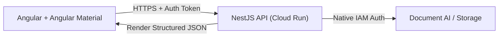

# Saldare Constitution

## Core Principles

### I. Three-Tier Architecture
The application follows a decoupled, secure three-tier architecture within the Google Cloud Platform (GCP) ecosystem. **Direct client-to-API communication with Document AI is strictly prohibited.**



**Architectural Flow:**
1. **Frontend:** Angular application utilizing Angular Material components captures and validates file uploads locally.
2. **Authentication:** Request is intercepted, injecting a Firebase Auth bearer token into the headers.
3. **Backend Routing:** Cloud Run receives the payload via the NestJS controller layer.
4. **Processing:** The NestJS service processes the document with Document AI **Form Parser**, normalizes the massive raw JSON metadata into a clean data contract, and returns a lightweight key-value response.

### II. Google-Centric Stack
To ensure maximum maintainability, unified billing, and structural symmetry across both layers, the project is locked to the following Google-centric stack:

| Layer | Technology | Hosting / Environment |
| :--- | :--- | :--- |
| **Frontend UI** | Angular (Latest) + **Angular Material** | **Firebase Hosting** (Global CDN) |
| **Backend API** | **NestJS** (TypeScript Architecture) | **Google Cloud Run** (Serverless Containers) |
| **Identity / Auth** | Firebase Authentication | Native Token Generation & Management |
| **AI Processing** | Cloud Document AI | **Form Parser** Processor |
| **File Storage** | Google Cloud Storage | Temporary Buckets (for heavy file batching) |

### III. No Secret Leaks
Never bundle GCP service account keys (`.json`) or master API keys within the client bundle.

### IV. Data Abstraction (DTOs)
Do not pass the raw Document AI output to the frontend. NestJS must parse the `document.pages.formFields` array and transform it into a simplified, flat JSON array structured via a typed Data Transfer Object (DTO).

### V. End-to-End Type Safety
Both the Angular client and the NestJS backend must share or mirror identical interfaces for the extracted data:

```typescript
export interface ExtractedFormField {
  label: string;
  value: string;
  confidence?: number; // Optional parsing confidence percentage
}
```

## Architecture & Implementation Guidelines

### Frontend (Angular + Angular Material)
- **UI Component Library:** Use **Angular Material** explicitly for all structural and input elements:
  - `MatFileUpload` / Custom drag-and-drop zones leveraging Material design principles.
  - `MatTable` or `MatCard` to display the extracted key-value results.
  - `MatProgressBar` / `MatProgressSpinner` to manage loading states during API extraction.
- **HttpInterceptor:** Implement an HTTP Interceptor to append the Firebase Auth JWT token to all outbound requests targeting the backend domain:
  ```typescript
  // Authorization: Bearer <JWT_TOKEN>
  ```

### Backend (NestJS on Cloud Run)
- **Architectural Symmetry:** Maintain clean separation of concerns using NestJS Controllers, Services, and Modules. Mirror the Angular dependency injection patterns.
- **Network Binding:** The NestJS application must explicitly listen on host `0.0.0.0` and utilize the dynamic port injected via environment variables in `main.ts`:
  ```typescript
  const port = process.env.PORT || 8080;
  await app.listen(port, '0.0.0.0');
  ```

### Shared Data Contracts
To guarantee end-to-end type safety, both the Angular client and the NestJS backend must share or mirror identical interfaces for the extracted data.

## Security & Compliance Matrix

### Endpoint Protection (User Space)
All NestJS controllers handling document ingestion must be protected by a custom `AuthGuard`. The guard must extract the Bearer token, verify its signature against Firebase Auth public keys (using `firebase-admin`), check expiration dates, and reject unauthenticated requests with an explicit **HTTP 401 Unauthorized** status.

### Platform Permissions (Infrastructure Space)
- **No Hardcoded Keys:** Do not use downloaded Service Account JSON files inside the production Cloud Run container.
- **IAM Roles:** Rely on Google Cloud Identity and Access Management (IAM). The Cloud Run service instance must run under a custom Service Account granted the minimal required roles:
  - `roles/documentai.viewer` (Document AI API User)
  - `roles/storage.objectAdmin` (If leveraging temporary GCS buckets for ingestion)

## Engineering Best Practices

- **State-Driven Ingestion:** For large files, utilize asynchronous processing via Cloud Storage hooks rather than blocking the HTTP connection thread.
- **Idempotency & Cost Control:** Validate input parameters on the backend before calling Document AI endpoints to prevent unnecessary API transaction costs on corrupt or unsupported file streams.
- **Error Handling:** Implement a global NestJS `ExceptionFilter` to format API errors cleanly before they hit the Angular Material frontend notification system (`MatSnackBar`).

## Governance

This Constitution is the **single source of truth** for the architecture, tech stack, and security guidelines of the application. All agent actions, code generation, and architectural decisions must strictly adhere to this document.

- **Supersedes:** This Constitution overrides any ad-hoc practices, personal preferences, or informal conventions.
- **Amendments:** Changes require a documented proposal, team approval, and a migration plan.
- **Compliance:** All PRs and code reviews must verify alignment with this Constitution.

**Version**: 1.0.0 | **Ratified**: 2026-05-29 | **Last Amended**: 2026-05-29
