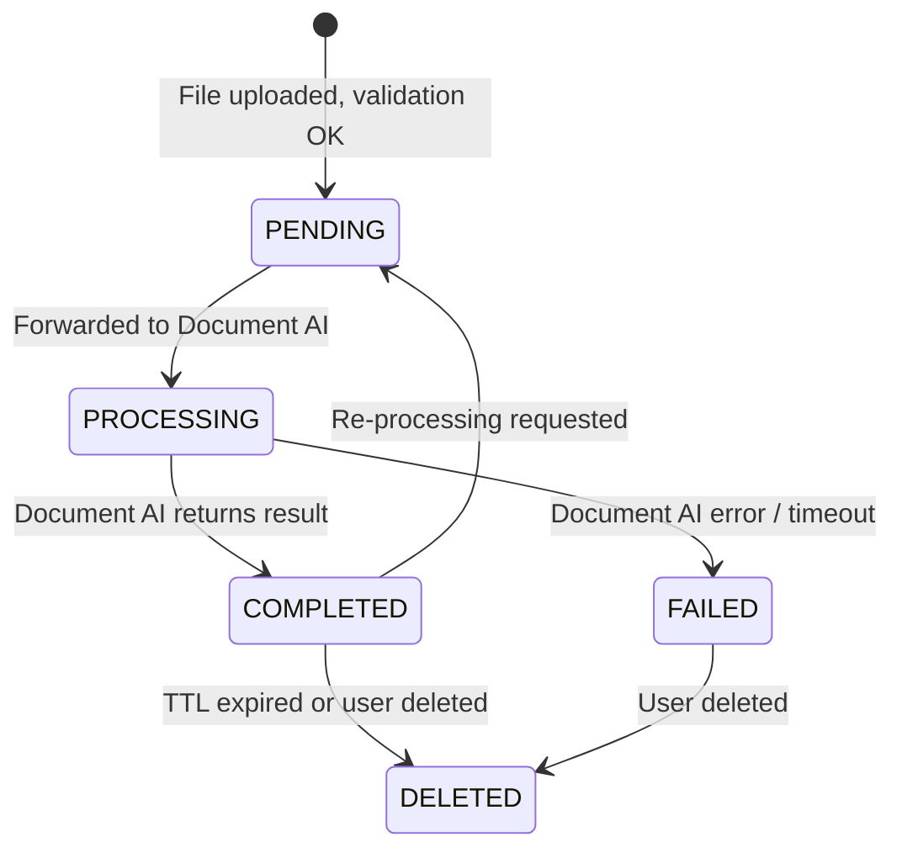

# Data Model: Google Document AI Integration

## Entities

### Document

Represents an uploaded file and its processing result.

| Field | Type | Description | Validation |
|-------|------|-------------|------------|
| `id` | UUID (v7) | Primary key, generated server-side | Auto-generated |
| `companyId` | UUID (v7) | Foreign key to the owning company | Required, indexed |
| `filename` | String(255) | Original uploaded filename | Required, 1-255 chars |
| `mimeType` | String(50) | Detected MIME type | Required, one of: `application/pdf`, `image/png`, `image/jpeg`, `image/tiff` |
| `fileSize` | Integer | File size in bytes | Required, 1-5_242_880 (max 5MB) |
| `status` | Enum | Processing status | See state transitions below |
| `extractedFields` | JSONB | Parsed form fields from Document AI | Nullable, populated on completion |
| `rawResponse` | JSONB | Full Document AI response (for debugging) | Nullable, populated on completion |
| `errorMessage` | Text | Error details if processing failed | Nullable |
| `ttlDays` | Integer | Days until auto-deletion | Default 30, min 1, max 365 |
| `createdAt` | Timestamp | Row creation time | Auto-set |
| `updatedAt` | Timestamp | Last update time | Auto-updated |
| `deletedAt` | Timestamp | Soft-delete timestamp | Nullable |

### ExtractedField

DTO mapped from Document AI `FormField` entries (not a separate DB table — stored as JSONB in Document).

| Field | Type | Description |
|-------|------|-------------|
| `label` | String | Field label/name from the form |
| `value` | String | Extracted text value |
| `confidence` | Float (0-1) | Optional parsing confidence score |

### DocumentQuery

Filters for the list endpoint.

| Field | Type | Default |
|-------|------|---------|
| `companyId` | UUID | Required |
| `status` | Enum (optional) | All |
| `page` | Integer | 1 |
| `limit` | Integer | 20 (max 100) |

## State Transitions

- **PENDING**: File accepted, validation passed, awaiting Document AI call.
- **PROCESSING**: Document AI call in flight (synchronous, typically <30s).
- **COMPLETED**: Extraction successful, `extractedFields` populated.
- **FAILED**: Processing error, `errorMessage` populated.
- **DELETED**: Soft-deleted via `deletedAt` timestamp.

## Validation Rules

| Rule | Enforcement |
|------|-------------|
| File size ≤ 5MB | Before processing, return 413 if exceeded |
| Supported MIME types only | Magic byte check + extension, return 415 if invalid |
| Document must belong to a valid company | `companyId` FK constraint |
| TTL must be 1-365 days | Backend validation |
| Filename must not contain path traversal | Sanitize before storage |
